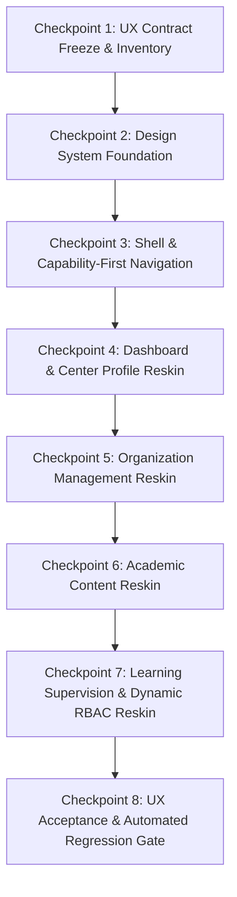

# KẾ HOẠCH NÂNG CẤP GIAO DIỆN CENTER MANAGER (LOVABLE REDESIGN BLUEPRINT)
## MILESTONE: POST-R09-CENTER-MANAGER-UX-REDESIGN

> **Dự án:** AI-Driven Adaptive Learning and Competency Assessment Platform (EduTwin)
> **Kế hoạch nền tảng:** `docs/plans/POST-R09-CENTER-MANAGER-OPS.md`
> **Baseline Git SHA:** `d62a310dc2b2d710236b4461fee76b1ab5012471` (Short: `d62a310`) — Commit hoàn tất khắc phục safe error panels, làm sạch whitespace, loại bỏ biến thừa, kiểm định 131/131 frontend tests, 0 lint error/warnings, clean build 395.27 KB
> **Branch thực thi chuyên biệt:** `codex/post-r09-center-manager-ux-redesign` (Tách nhánh độc lập trực tiếp từ baseline `d62a310`)
> **Nguồn ảnh thiết kế mẫu:** `C:\Users\ACER\OneDrive\Pictures\Screenshots` (18 ảnh chụp màn hình Lovable)
> **Visual Anchor (Tiêu chuẩn mỹ thuật):** **Ảnh 18 (`Screenshot 2026-09-15 160355.png`)**
> **Định phong cách (Design Tone):** **Dark Enterprise SaaS + Restrained AI Accent** (Không lạm dụng glassmorphism/glow; ưu tiên spacing, hierarchy, surface layers, typography và density chuẩn enterprise)

---

## 1. NGUYÊN TẮC BẤT BIẾN & CÁC QUY TẮC SẮT (IRON RULES)

### 1.1. Quy tắc 1: Frontend-Only by Default
- Tuyệt đối không thay đổi backend/API schema để khớp với mockup giao diện.
- Nếu mockup có trường hoặc chỉ số mà API thực tế không có, quy tắc bắt buộc là: **loại bỏ trường đó khỏi UI**.
- Bảo vệ tuyệt đối 3.472 backend tests và trạng thái kỹ thuật đã đóng băng.

### 1.2. Quy tắc 2: Actor Isolation Rule (Bảo vệ tuyệt đối phạm vi Actor)
- **Mục tiêu tối thượng:** Đợt redesign này dành riêng cho vai trò **CenterManager**. Tuyệt đối **KHÔNG ĐƯỢC LÀM THAY ĐỔI** giao diện hay trải nghiệm của **Teacher, Student hoặc PlatformAdmin** trên các route/component dùng chung.
- **Rủi ro hiện hữu:** Trong routing hiện tại, nhiều trang được chia sẻ giữa các actor:
  * Bài tập (`/quan-ly/bai-tap`, tạo mới, sửa, tiến độ) cho phép cả `CenterManager` và `Teacher` (`accountTypes={["CenterManager", "Teacher"]}`).
  * Đồ thị tri thức (`/kien-thuc/do-thi`), Giáo trình (`/quan-ly/giao-trinh`), Ngân hàng câu hỏi (`/quan-ly/cau-hoi`), Hàng đợi xem xét (`/quan-ly/duyet-bai`), Năng lực học sinh (`/quan-ly/hoc-sinh/:studentId/nang-luc`) đều được kiểm soát theo năng lực (capability-based), Teacher có quyền vẫn có thể truy cập.
- **Chiến lược phân lập hiển thị (Presentation Isolation Strategy):**
  * **Không sửa đổi CSS toàn cục (global CSS/tokens)** khiến các actor khác bị ảnh hưởng ngoài ý muốn.
  * Toàn bộ design tokens và theme mới của CenterManager phải được cô lập theo phạm vi (scoped), ví dụ:
    $$\text{CenterManagerLayout} \longrightarrow \text{container với thuộc tính } \texttt{data-actor="center-manager"}$$
  * Với các màn hình dùng chung, áp dụng một trong hai phương án an toàn:
    1. *Actor-Scoped Styling:* Theme Dark/Cyan mới chỉ áp dụng khi phần tử cha mang `data-actor="center-manager"`.
    2. *Tách Presentation View:* Giữ chung feature hooks và logic nghiệp vụ, tách view thành `CenterManager[Feature]View` (reskin mới) và `Teacher[Feature]View` (giữ nguyên hiện trạng cho tới khi đến milestone của Teacher).

### 1.3. Quy tắc 3: Visual Language — Dark Enterprise SaaS (Dựa trên Ảnh 18)
- **Bảng màu chủ đạo:**
  - Nền chính (Background): Deep Dark Slate/Navy (`#0B0F19`).
  - Bề mặt Card/Panel (Surfaces): Dark Surface Layered (`#111827`, `#1E293B`).
  - Viền phân cách (Borders): Tinh tế, tương phản vừa phải (`#334155`), chỉ dùng viền sáng nhẹ khi hover hoặc focus.
  - Điểm nhấn (Restrained Accents): Cyan/Indigo/Violet (`#06B6D4`, `#6366F1`, `#8B5CF6`) được kiểm soát chặt chẽ, **chỉ dùng cho**:
    1. Trạng thái điều hướng active.
    2. Nút thao tác chính (Primary CTA).
    3. Trạng thái lựa chọn / viền focus accessibility.
    4. Trục và đường nét của biểu đồ (chart accents).
    5. Huy hiệu nhãn phân tích suy luận AI (AI observation badge).
  - **Tiết chế tối đa:** Tránh hiệu ứng "gaming dashboard". Không lạm dụng viền phát sáng (glow borders) hay kính mờ (glassmorphism) diện rộng trên các bảng biểu, input và modal.
- **Typography & Layout Density:**
  - Phân cấp thị giác rõ nét: tiêu đề h1/h2 (font-weight 600), nhãn trường (500), nội dung (400).
  - Mật độ thông tin chuẩn Enterprise: bảng dữ liệu gọn, padding vừa vặn, không để khoảng trống vô nghĩa nhưng không nhồi nhét.

### 1.4. Quy tắc 4: Tính chân thực của dữ liệu (0 Fake KPI & Metrics)
- Không sao chép các số liệu giả lập trong ảnh Lovable (như "86,4% hoàn thành tuần này", "1.248 bài tập", "32 học sinh cần hỗ trợ", "246 evidence mới", "Cập nhật 10 phút trước").
- **Dữ liệu Dashboard tại `/quan-ly/tong-quan-trung-tam` chỉ ánh xạ 100% vào DTO thực tế:**
  - `summary.teacherCount` → Tổng số giáo viên.
  - `summary.studentCount` → Tổng số học sinh.
  - `summary.classCount` → Tổng số lớp học.
  - `masteryBySubject.length` → Số môn học đã có dữ liệu đo lường năng lực (hoặc phân phối theo từng môn).
  - `highRiskByClass` → Danh sách cảnh báo nguy cơ theo lớp.
  - `classRanking` → Bảng xếp hạng lớp học.
  - `generatedAt` → Thời điểm tổng hợp dữ liệu.
- Không tự tính tỷ lệ phần trăm trung bình ở client nếu backend chưa định nghĩa rõ ngữ nghĩa.

### 1.5. Quy tắc 5: Ngữ cảnh Trung tâm Động chỉ đọc (Dynamic Center Context Card)
- Không tạo điều khiển "Tenant Switcher" như trong mockup Lovable.
- CenterManager chỉ hoạt động trong trung tâm được gán; PlatformAdmin mới là actor quản lý nhiều trung tâm.
- Giữ hình thức card ở góc trên Sidebar theo Ảnh 18 nhưng là **Center Context Card chỉ đọc** lấy động từ phiên đăng nhập và API:
  - Tên trung tâm: lấy động từ session (`user.centerName`) hoặc `GET /api/v1/centers/me` (`center.centerName`).
  - Mã trung tâm & Trạng thái: lấy động từ `center.centerCode` và `center.status` (định dạng hiển thị: `{centerCode} · Đang hoạt động`).
  - **Tuyệt đối không hard-code** tên/mã trung tâm trong mã nguồn; không tạo dropdown chuyển tenant giả.

### 1.6. Quy tắc 6: Phân quyền động chuẩn xác (Scoped RBAC Intersection)
- Ma trận phân quyền của CenterManager không phải là hiển thị 70 checkbox tùy tiện, mà là tập giao:
  $$\text{Permissions} = \text{Active} \cap \text{Compatible with Target AccountType} \cap \text{Delegable} \cap \text{Actor's Effective Permissions}$$
- Nhãn cảnh báo thị giác riêng cho các quyền nhạy cảm (`IsSensitive = true`).
- Giữ nguyên toàn bộ logic phân trang server-side, tìm kiếm và phân rã quyền hiệu lực (`effective permissions breakdown`) đã kiểm chứng ở Giai đoạn H.

### 1.7. Quy tắc 7: Bảo toàn OCC RowVersion & Xử lý lỗi an toàn
- Mọi form cập nhật bắt buộc gửi `RowVersion`. Khi gặp `409 Concurrency Conflict`, hiển thị `ConcurrencyBanner` với nút "Tải lại dữ liệu mới nhất".
- Mọi thông báo lỗi hiển thị cho người dùng (user-visible) **bắt buộc phải qua helper sản xuất `mapSafeOperationalError`** (từ `src/utils/problemDetails.ts`) hoặc safe mapper tương đương hiện hữu; **tuyệt đối không render trực tiếp `extractProblemDetails().detail` hoặc `title` thô** ra UI.

### 1.8. Quy tắc 8: Performance Budget & Giới hạn Knowledge Graph đúng API
- **Performance Budget:**
  - Main bundle: `<= baseline 395 KB + tối đa 10%` (~ 435 KB).
  - Không chunk nào > 500 KB (xóa sạch cảnh báo Vite).
  - Không eager-import toàn bộ icon hoặc charting library; giữ vững lazy loading ở cấp route.
- **Giới hạn Knowledge Graph đúng API:**
  - Được phép nâng cấp visual đồ thị cho đẹp mắt, hiện đại và trực quan hơn.
  - Tuyệt đối KHÔNG thiết kế tính năng kéo thả (drag & drop) lưu tọa độ cố định của Node nếu backend không có schema/contract lưu tọa độ (X, Y). Mọi layout đồ thị phải là deterministic canvas layout hoặc auto-layout phía client.

---

## 2. LỘ TRÌNH 8 CHECKPOINTS THỰC THI (UX REDESIGN PIPELINE)



---

### Checkpoint 1: UX Contract Freeze & Inventory
* **Trạng thái:** **HOÀN THÀNH — SẴN SÀNG REVIEW (GATE 1 PASS / AWAITING PO APPROVAL)**
* **Baseline Git SHA:** `d62a310dc2b2d710236b4461fee76b1ab5012471` (Branch: `codex/post-r09-center-manager-ux-redesign`)
* **Mục tiêu:** Khóa bất biến baseline kỹ thuật `d62a310`, lập bảng kiểm kê toàn diện tất cả các route/component/DTO mà CenterManager có thể truy cập, phân định ranh giới Actor Isolation và loại bỏ triệt để các trường dữ liệu giả mạo.

#### 1. Bảng kiểm kê Route & Component toàn diện của CenterManager (19 route patterns / 16 distinct pages)

| STT | Route Pattern | Component File | Account Types được phép | Dùng chung (Shared)? | Quyền yêu cầu (Permissions) | Nghiệp vụ / Mutations / Modals | Ràng buộc OCC (RowVersion)? | Chiến lược hiển thị CenterManager (Actor Isolation) |
|---|---|---|---|---|---|---|---|---|
| 1 | `/` | `src/pages/AuthenticatedHomePage.tsx` | All authenticated | **Có** (Shared Portal) | Đã đăng nhập (`sessionStatus === 'authenticated'`) | Điều hướng portal theo quyền hiệu lực | Không | Giữ nguyên logic điều hướng; nếu là CenterManager, hiển thị scoped quick-links sang `/quan-ly/tong-quan-trung-tam` |
| 2 | `/quan-ly/trung-tam` | `src/pages/CenterProfilePage.tsx` | `CenterManager` | **Không** (Độc quyền CenterManager) | `center.read` \| `center.manage` | Xem thông tin trung tâm, cập nhật Tên & Múi giờ | **Có** (`updateCenterProfile` gửi `rowVersion`, hiển thị `ConcurrencyBanner` khi 409) | **Direct Reskin:** Dark Enterprise SaaS, card chỉ đọc cho mã/trạng thái, form sửa tên/múi giờ |
| 3 | `/quan-ly/tong-quan-trung-tam` | `src/pages/CenterDashboardPage.tsx` | Any có quyền (CenterManager) | **Không** (Độc quyền CenterManager) | `dashboards.center.read` | Lọc theo môn học (`subjectId`), làm mới dữ liệu | Không (Read-only query) | **Direct Reskin (Canonical Route):** Bố cục lưới Ảnh 18, 4 thẻ KPI thật, biểu đồ năng lực theo môn, bảng nguy cơ theo lớp |
| 4 | `/quan-ly/giao-vien` | `src/pages/TeacherListPage.tsx` | Any có quyền (CenterManager) | **Không** (Độc quyền CenterManager) | `teachers.read` (`teachers.create`, `teachers.update`, `teachers.delete`) | CRUD giáo viên, `TeacherDetailModal`, `PasswordResetModal`, xóa mềm với 409 dependency guard | **Có** (`RowVersion` trên form sửa giáo viên) | **Direct Reskin:** Dark table theo Ảnh 4, reskin toàn bộ modals & forms |
| 5 | `/quan-ly/lop-hoc` | `src/pages/ClassListPage.tsx` | Any có quyền (CenterManager) | **Không** (Độc quyền CenterManager) | `classes.read` (`classes.create`, `classes.update`, `classes.students.manage`) | CRUD lớp học, `ClassDetailModal`, `AddStudentsModal` (SQL anti-join, server paging), `RemoveStudentModal` | **Có** (`RowVersion` trên form sửa lớp) | **Direct Reskin:** Dark table theo Ảnh 6, reskin modals thêm/rút học sinh |
| 6 | `/quan-ly/hoc-sinh` | `src/pages/StudentListPage.tsx` | Any có quyền (CenterManager) | **Không** (Độc quyền CenterManager) | `students.read` (`students.create`, `students.update`, `students.delete`) | CRUD học sinh, `StudentDetailModal`, `SubjectGoalsModal` (twin goals), `PasswordResetModal`, xóa mềm | **Có** (`RowVersion` trên form sửa học sinh) | **Direct Reskin:** Dark table theo Ảnh 5, reskin SubjectGoalsModal & reset pass |
| 7 | `/quan-ly/mon-hoc` | `src/pages/SubjectListPage.tsx` | Any có quyền (CenterManager) | **Không** (Độc quyền CenterManager) | `subjects.read` (`subjects.create`, `subjects.update`, `subjects.delete`) | CRUD môn học, liên kết sang Knowledge Graph | **Có** (`RowVersion` trên form sửa môn học) | **Direct Reskin:** Dark table theo Ảnh 7, modal sửa môn học |
| 8 | `/quan-ly/phan-quyen` | `src/pages/AuthorizationManagementPage.tsx` | `CenterManager` | **Không** (Độc quyền CenterManager) | `authorizationUiPermissions` (`roles.read`, `user_roles.read`, `audit.read`) | Tab 1 (Vai trò & Ma trận 70 quyền, badge sensitive), Tab 2 (Gán vai trò & Effective attribution), Tab 3 (Nhật ký kiểm toán đã khử khuẩn, trace ID copy) | **Có** (`RowVersion` trên cập nhật vai trò/quyền) | **Direct Reskin:** Dark Enterprise SaaS, cấu trúc 3 Tabs, phân trang server-side, 0 fake permissions |
| 9 | `/quan-ly/tong-quan-lop-hoc`<br/>`/quan-ly/lop-hoc/:classId/tong-quan` | `src/pages/TeacherClassDashboardPage.tsx` | Any có quyền (Teacher, CenterManager) | **Có** (Shared Teacher / CenterManager) | `dashboards.teacher.read` \| `dashboards.center.read` | Giám sát lớp học, danh sách học sinh nguy cơ cao, chủ đề yếu, gap groups | Không (Read-only query) | **Actor Scoped:** Bọc container `data-actor="center-manager"` khi user là CenterManager; bảo toàn nguyên vẹn giao diện Teacher |
| 10 | `/quan-ly/duyet-bai` | `src/pages/ReviewQueuePage.tsx` | Any có quyền (Teacher, CenterManager) | **Có** (Shared Teacher / CenterManager) | `reviews.read` (`reviews.override`) | Bố cục Master/Detail: đối chiếu bài làm + AI observation + rule-based score, ghi đè điểm với lý do bắt buộc, Scratchpad Canvas drawer. **Loại bỏ nút prototype "Mô phỏng 409"** | **Có** (`RowVersion` bắt buộc khi gửi review override) | **Actor Scoped:** Bọc container `data-actor="center-manager"` khi user là CenterManager; bảo toàn nguyên vẹn giao diện Teacher |
| 11 | `/quan-ly/hoc-sinh/:studentId/nang-luc` | `src/pages/TeacherStudentTwinPage.tsx` | Any có quyền (Teacher, CenterManager) | **Có** (Shared Teacher / CenterManager) | `twin.student.read.scoped` | Radar năng lực chủ đề học sinh, đường tiến độ học tập, hành động khuyến nghị | Không (Read-only query) | **Actor Scoped:** Áp dụng dark theme khi `data-actor="center-manager"`; giữ nguyên Teacher view |
| 12 | `/kien-thuc/do-thi` | `src/pages/KnowledgeGraphPage.tsx` | Any có quyền (Teacher, CenterManager) | **Có** (Shared Teacher / CenterManager) | `subjects.read`, `knowledge.nodes.read`, `knowledge.edges.read` | Canvas đồ thị tri thức, Right Inspector Panel xem/sửa Node & Edge, bắt lỗi chu trình (Cycle detection) an toàn. **KHÔNG drag/drop lưu tọa độ** (không có API schema) | **Có** (`RowVersion` trên Node và Edge mutations) | **Actor Scoped:** Canvas Dark tone và Inspector panel cho CenterManager; giữ nguyên Teacher graph canvas |
| 13 | `/quan-ly/giao-trinh` | `src/pages/CurriculumListPage.tsx` | Any có quyền (Teacher, CenterManager) | **Có** (Shared Teacher / CenterManager) | `curriculums.read` | Danh sách giáo trình theo trạng thái (Draft, Published, Archived), chuyển trạng thái | Không (Query & state actions) | **Actor Scoped:** Scoped dark table cho CenterManager; giữ nguyên Teacher view |
| 14 | `/quan-ly/giao-trinh/tao-moi`<br/>`/quan-ly/giao-trinh/:id` | `src/pages/CurriculumEditorPage.tsx` | Any có quyền (Teacher, CenterManager) | **Có** (Shared Teacher / CenterManager) | `curriculums.create` / `curriculums.update` | Trình soạn giáo trình: chọn thứ tự Knowledge Nodes, liên kết lớp học nguyên tử, xác nhận Publish | **Có** (`RowVersion` khi cập nhật giáo trình) | **Actor Scoped:** Scoped Dark Editor cho CenterManager; giữ nguyên Teacher editor |
| 15 | `/quan-ly/cau-hoi` | `src/pages/QuestionBankPage.tsx` | Any có quyền (Teacher, CenterManager) | **Có** (Shared Teacher / CenterManager) | `questions.read` | Danh sách câu hỏi, bộ lọc môn học/độ khó/dạng câu hỏi | Không (Query & state actions) | **Actor Scoped:** Scoped dark list cho CenterManager; giữ nguyên Teacher view |
| 16 | `/quan-ly/cau-hoi/tao-moi`<br/>`/quan-ly/cau-hoi/:id` | `src/pages/QuestionEditorPage.tsx` | Any có quyền (Teacher, CenterManager) | **Có** (Shared Teacher / CenterManager) | `questions.create` / `questions.update` | Soạn thảo KaTeX, chuẩn hóa `QuestionAnswerEvaluationMode` (`"TextExact"`, `"NumericRational"`, `"Manual"`), `reasoningRequired`, chuyển trạng thái Draft/Active/Archived | **Có** (`RowVersion` khi cập nhật câu hỏi) | **Actor Scoped:** Scoped Dark Editor cho CenterManager; giữ nguyên Teacher editor |
| 17 | `/quan-ly/bai-tap` | `src/pages/AssignmentListPage.tsx` | `CenterManager`, `Teacher` | **Có** (Shared Teacher / CenterManager) | `assignments.read` | Danh sách bài tập, bộ lọc lớp, trạng thái Draft/Published/Archived | Không (Query & state actions) | **Actor Scoped:** Scoped dark list cho CenterManager; giữ nguyên Teacher view |
| 18 | `/quan-ly/bai-tap/tao-moi`<br/>`/quan-ly/bai-tap/:id` | `src/pages/AssignmentEditorPage.tsx` | `CenterManager`, `Teacher` | **Có** (Shared Teacher / CenterManager) | `assignments.create` / `assignments.update` | Chọn câu hỏi, gán lớp, xem trước Target Summary, Publish bài tập | **Có** (`RowVersion` khi cập nhật bài tập) | **Actor Scoped:** Scoped Dark Editor cho CenterManager; giữ nguyên Teacher editor |
| 19 | `/quan-ly/bai-tap/:id/tien-do` | `src/pages/AssignmentProgressPage.tsx` | `CenterManager`, `Teacher` | **Có** (Shared Teacher / CenterManager) | `assignments.read` | Theo dõi tiến độ bài tập theo học sinh (`studentId`, `fullName`, `status`, `completedQuestionCount`/`totalQuestionCount`). **LOẠI BỎ ĐIỂM SỐ AGGREGATE THEO LỚP** | Không (Read-only query) | **Actor Scoped:** Scoped Dark progress list cho CenterManager; giữ nguyên Teacher view |

---

#### 2. Phân loại 2 nhóm hiển thị phục vụ Actor Isolation

1. **Nhóm 1 — Màn hình Độc quyền của CenterManager (7 trang):**
   - Hồ sơ trung tâm (`/quan-ly/trung-tam`)
   - Dashboard Trung tâm (`/quan-ly/tong-quan-trung-tam`)
   - Quản lý Giáo viên (`/quan-ly/giao-vien`)
   - Quản lý Lớp học (`/quan-ly/lop-hoc`)
   - Quản lý Học sinh (`/quan-ly/hoc-sinh`)
   - Quản lý Môn học (`/quan-ly/mon-hoc`)
   - Quản lý Phân quyền (`/quan-ly/phan-quyen`)
   *→ Áp dụng trực tiếp App Shell và Theme Dark Enterprise SaaS mới.*

2. **Nhóm 2 — Màn hình Dùng chung với Teacher / Actor khác (9 trang / 12 route patterns):**
   - Portal chung (`/`)
   - Dashboard Lớp học (`/quan-ly/tong-quan-lop-hoc`, `/quan-ly/lop-hoc/:classId/tong-quan`)
   - Hàng đợi xem xét bài tập (`/quan-ly/duyet-bai`)
   - Năng lực học sinh (`/quan-ly/hoc-sinh/:studentId/nang-luc`)
   - Đồ thị tri thức (`/kien-thuc/do-thi`)
   - Giáo trình (`/quan-ly/giao-trinh`, `/tao-moi`, `/:id`)
   - Ngân hàng câu hỏi (`/quan-ly/cau-hoi`, `/tao-moi`, `/:id`)
   - Bài tập (`/quan-ly/bai-tap`, `/tao-moi`, `/:id`, `/:id/tien-do`)
   *→ Bắt buộc dùng `data-actor="center-manager"` hoặc tách view độc lập để bảo toàn 100% UI Teacher.*

---

#### 3. Bảng đối chiếu DTO Hợp đồng & Loại bỏ các trường giả mạo (Fake Fields Elimination)

| Module / Màn hình | DTO / Contract thực tế | Trường dữ liệu thực tế (100% Ground Truth) | Trường giả lập trong Lovable (BẮT BUỘC LOẠI BỎ) | Xử lý giao diện chuẩn xác |
|---|---|---|---|---|
| **Center Dashboard** | `CenterDashboardDataDto` | - `summary`: `studentCount`, `classCount`, `teacherCount`<br/>- `masteryBySubject`: `subjectId`, `subjectName`, `averageMastery`<br/>- `highRiskByClass`: `classId`, `className`, `highRiskStudentCount`, `totalStudentCount`<br/>- `classRanking`: `rank`, `classId`, `className`, `subjectName`, `averageMastery`, `assignmentCompletionRate`<br/>- `generatedAt`: ISO string | - "86,4% hoàn thành tuần này"<br/>- "1.248 bài tập đã tạo"<br/>- "32 học sinh cần hỗ trợ ngay"<br/>- "246 evidence mới trong 24h"<br/>- "Cập nhật 10 phút trước" | Hiển thị 4 thẻ KPI dựa trên DTO thật: Giáo viên (`summary.teacherCount`), Học sinh (`summary.studentCount`), Lớp học (`summary.classCount`), Môn học đo lường (`masteryBySubject.length`). Thời điểm lấy từ `generatedAt`. Không tính toán aggregate giả. |
| **Center Context Card** (Góc Sidebar) | Session / `GET /api/v1/centers/me` | - `centerName`: tên trung tâm hiện tại<br/>- `centerCode`: mã trung tâm (ví dụ `CN-HCM-01`)<br/>- `status`: trạng thái (`Active`) | - Dropdown chuyển đổi trung tâm / tenant switch<br/>- Danh sách tenant chi nhánh khác | Thẻ thông tin **ĐỘNG CHỈ ĐỌC (Read-only)**: Hiển thị tên trung tâm và nhãn `{centerCode} · Đang hoạt động`. Không có dropdown chọn tenant. |
| **Question Bank / Editor** | `QuestionAnswerEvaluationMode` | `"TextExact"` \| `"NumericRational"` \| `"Manual"`<br/>Thuộc tính phụ trợ: `reasoningRequired` (boolean) | - Mode "AI Reasoning" giả mạo biến thành evaluation mode | Dropdown chế độ chấm hiển thị đúng 3 giá trị contract. Checkbox riêng cho "Yêu cầu suy luận AI" (`reasoningRequired`). |
| **Assignment Progress** | `AssignmentProgressItemDto` | - `studentId`: string<br/>- `fullName`: string<br/>- `status`: ProgressStatus<br/>- `completedQuestionCount`: number<br/>- `totalQuestionCount`: number | - "Điểm số trung bình cả lớp"<br/>- "Điểm số từng học sinh"<br/>- Phân phối điểm số theo thang điểm 10 | Bảng tiến độ chỉ hiển thị trạng thái và tiến độ câu hỏi (`{completedQuestionCount}/{totalQuestionCount}`). Loại bỏ hoàn toàn cột điểm số cho đến khi API hỗ trợ. |
| **Knowledge Graph** | `KnowledgeNodeDto`, `KnowledgeEdgeDto` | - Canonical node / edge attributes<br/>- `RowVersion`<br/>- Cycle detection guard | - Drag & drop lưu tọa độ cố định (X, Y) | Bố cục Canvas dùng thuật toán tự động (client-side auto-layout / force simulation). Không thêm payload tọa độ vào mutations vì backend không có schema lưu trữ. |
| **Review Queue** | `TeacherReviewItemDto`, `OverrideScoreRequest` | - Bài làm gốc của học sinh<br/>- Quan sát / giải trình của AI<br/>- Điểm số chấm theo quy tắc<br/>- `overrideScore`, `overrideReason` (bắt buộc)<br/>- `RowVersion` | - Nút prototype/debug "Mô phỏng 409" | Bố cục Master/Detail. Xóa sạch nút debug "Mô phỏng 409". Xử lý xung đột OCC qua `ConcurrencyBanner` chuẩn sản xuất. |
| **Phân quyền RBAC** | `PermissionDto`, `RoleDto` | - 70 permissions phân loại theo module<br/>- Tập giao: Active $\cap$ Compatible $\cap$ Delegable $\cap$ Actor's Effective<br/>- Cờ `IsSensitive` | - 70 checkbox phẳng không phân nhóm<br/>- Tùy ý gán quyền không tương thích | Ma trận quyền hiển thị theo 6 nhóm tính năng, làm nổi bật nhãn cảnh báo đỏ cho quyền `IsSensitive = true`. 3 tabs tách biệt, phân trang server-side. |

---

#### 4. Quy tắc bảo vệ OCC & Error Handling an toàn (Production Grade)

1. **Bắt buộc gửi `RowVersion` trên mọi Mutation:**
   - Cập nhật hồ sơ trung tâm (`CenterProfilePage`)
   - Cập nhật môn học (`SubjectListPage`)
   - Cập nhật Node / Edge (`KnowledgeGraphPage`)
   - Cập nhật & Publish giáo trình (`CurriculumEditorPage`)
   - Cập nhật câu hỏi (`QuestionEditorPage`)
   - Cập nhật & Publish bài tập (`AssignmentEditorPage`)
   - Ghi đè điểm xem xét (`ReviewQueuePage`)
   - Cập nhật vai trò & phân quyền (`AuthorizationManagementPage`)
2. **Xử lý xung đột đồng thời HTTP 409:**
   - Hiển thị component `ConcurrencyBanner` với thông điệp: *"Dữ liệu đã được cập nhật bởi quản trị viên khác. Vui lòng tải lại dữ liệu mới nhất trước khi tiếp tục."*
   - Cung cấp nút "Tải lại dữ liệu" để đồng bộ `RowVersion` mới nhất từ server.
3. **Safe Error Mapping (Khử khuẩn thông báo lỗi):**
   - Mọi lỗi hiển thị trên giao diện người dùng bắt buộc phải đi qua `mapSafeOperationalError` (từ `src/utils/problemDetails.ts`).
   - Tuyệt đối không render trực tiếp thuộc tính thô `detail` hoặc `title` từ response backend ra UI để tránh lộ thông tin nội bộ hệ thống.
   - Khi có `traceId`, hiển thị nhãn mã theo dõi hỗ trợ (ví dụ: `Mã theo dõi: 00-4bf92f3577b34da6a3ce929d0e0e4736-00f067aa0ba902b7-01`).

---

#### 5. Điều kiện dừng nghiêm ngặt sau Gate 1

> [!IMPORTANT]
> **GATE 1 CHECKPOINT STOP:**
> Toàn bộ bảng kiểm kê Route, Component, DTO Mapping và phân lập Actor Isolation trên đây đã được lập tại baseline chính thức `d62a310`.
> **DỪNG LẠI TẠI ĐÂY.** Không được phép viết mã nguồn cho Checkpoint 2 (Design System Foundation) hoặc các Checkpoint tiếp theo cho đến khi Product Owner và Codex kiểm tra, phản biện và phê duyệt hoàn toàn bảng kiểm kê Gate 1 này.


---

### Checkpoint 2: Design System Foundation
* **Mục tiêu:** Xây dựng hệ thống Design Tokens và thư viện Atomic Components theo chuẩn Ảnh 18 (Dark Enterprise SaaS), đóng gói trong phạm vi actor CenterManager.
* **Chi tiết công việc:**
  1. Thiết lập CSS Variables / Scoped Tokens dưới selector `[data-actor="center-manager"]` hoặc `CenterManagerLayout`:
     - Surfaces (`#0B0F19`, `#111827`, `#1E293B`), borders (`#334155`), text hierarchy (primary `#F8FAFC`, secondary `#94A3B8`, muted `#64748B`), accents (`#06B6D4`, `#6366F1`).
     - Spacing, border radius (`rounded-lg`, `rounded-xl`), elevation & subtle focus rings.
  2. Xây dựng các component dùng chung (Reusable Atoms & Molecules):
     - `PageHeader`: Tiêu đề trang, mô tả, breadcrumb, khu vực nút thao tác chính.
     - `MetricCard`: Thẻ chỉ số hiển thị icon, giá trị số lớn, nhãn phụ, xu hướng (chỉ khi có data thật).
     - `DataTable`: Khung bảng dark theme, header cố định, phân trang gọn gàng, empty state, loading skeleton.
     - `StatusBadge`: Phân loại màu trạng thái chuẩn (`Active`, `Inactive`, `Archived`, `Draft`, `Published`).
     - `FilterBar`: Thanh tìm kiếm, dropdown lọc theo môn/lớp/trạng thái.
     - `Drawer` & `ConfirmDialog`: Panel trượt bên phải và modal xác nhận với focus trap, phím Escape.
     - `ConcurrencyBanner`: Khung cảnh báo xung đột OCC 409 với nút refetch.
     - `SafeErrorPanel`: Hiển thị lỗi an toàn sử dụng `mapSafeOperationalError` (kèm Trace ID).
     - `Skeleton`: Hiệu ứng nạp dữ liệu nền tối thanh lịch.
* **Tiêu chí nghiệm thu (Gate 2):** Component render đúng ARIA attributes, dark mode hoàn hảo, không rò rỉ style làm đổi UI Teacher/Student.

---

### Checkpoint 3: Shell & Capability-First Navigation
* **Mục tiêu:** Tái cấu trúc App Shell hoàn chỉnh theo ngôn ngữ Ảnh 18 cho CenterManager, liên kết chặt chẽ với hệ thống phân quyền của người dùng.
* **Chi tiết công việc:**
  1. `Sidebar` chuẩn Ảnh 18:
     - Nhóm 5 khu vực: Tổng quan, Tổ chức, Nội dung học thuật, Giám sát học tập, Quản trị & bảo mật.
     - **Sửa lỗi trùng lặp:** Loại bỏ mục "Nhật ký phân quyền" riêng biệt trên Sidebar; gộp thành Tab 3 trong "Vai trò & Phân quyền".
     - **Sửa lỗi Active State:** Đồng bộ chính xác 1 route tương ứng duy nhất 1 mục active sáng trên Sidebar.
     - **Center Context Card:** Thẻ thông tin trung tâm ở góc trên Sidebar dạng **động chỉ đọc** (lấy từ session/API), không có tính năng chuyển tenant.
     - **Capability-First Gating:** Menu chỉ hiển thị những mục mà tài khoản hiện tại có quyền đọc (`usePermission`).
  2. `Header`:
     - Breadcrumb động phản ánh vị trí trang.
     - Tenant/Center badge tĩnh lấy động từ API.
     - User profile dropdown: Tên hiển thị, vai trò (`SYSTEM_CENTERMANAGER` hoặc tên custom role), nút Đăng xuất.
* **Tiêu chí nghiệm thu (Gate 3):** Navigation mượt mà; 1 route = 1 active state; sidebar tự co giãn trên desktop/tablet/mobile; URL trực tiếp vẫn tuân thủ route guard.

---

### Checkpoint 4: Dashboard & Center Profile Reskin
* **Mục tiêu:** Thay giao diện mới cho trang Dashboard (`/quan-ly/tong-quan-trung-tam`) và Hồ sơ trung tâm (`/quan-ly/trung-tam`).
* **Chi tiết công việc:**
  1. `CenterDashboardPage` (Canonical route: `/quan-ly/tong-quan-trung-tam`):
     - Bố cục lưới theo Ảnh 18.
     - 4 Thẻ KPI trên cùng ánh xạ chính xác vào DTO thực tế:
       * Giáo viên: `summary.teacherCount`.
       * Học sinh: `summary.studentCount`.
       * Lớp học: `summary.classCount`.
       * Môn học đo lường năng lực: `masteryBySubject.length`.
     - Khu vực biểu đồ phân phối năng lực theo môn (`masteryBySubject`) và bảng nguy cơ theo lớp (`highRiskByClass`).
     - Giữ nguyên bộ lọc Môn học (`subjectId`), thời điểm `generatedAt`, và nút tải lại dữ liệu.
  2. `CenterProfilePage` (`/quan-ly/trung-tam`):
     - Bố cục thẻ Dark Enterprise SaaS.
     - Phân định rõ ràng: `Mã trung tâm` và `Trạng thái` ở chế độ **chỉ đọc (Read-only)**.
     - Form cập nhật `Tên trung tâm` và `Múi giờ` sử dụng `RowVersion`.
     - Tích hợp `ConcurrencyBanner` khi bắt lỗi 409 từ API.
* **Tiêu chí nghiệm thu (Gate 4):** Dashboard hiển thị 100% dữ liệu thực tế từ endpoint `GET /api/v1/centers/me/dashboard`; cập nhật hồ sơ trung tâm kiểm tra OCC hoạt động chính xác; route `/` vẫn là portal điều hướng phân quyền an toàn.

---

### Checkpoint 5: Organization Management Reskin (Khối Tổ chức)
* **Mục tiêu:** Reskin toàn diện các trang Giáo viên, Học sinh, Lớp học, Môn học, bảo tồn toàn bộ các luồng thao tác nghiệp vụ sâu và modal đã kiểm chứng.
* **Chi tiết công việc:**
  1. `TeacherListPage`:
     - Bảng danh sách theo Ảnh 4.
     - Khoác giao diện mới cho `TeacherDetailModal` (hiển thị danh sách lớp phụ trách).
     - Form tạo/sửa giáo viên và `PasswordResetModal`.
     - Xóa mềm giáo viên: hiển thị xác nhận và bắt lỗi 409 thân thiện nếu còn lớp phụ trách.
  2. `StudentListPage`:
     - Bảng danh sách học sinh theo Ảnh 5.
     - Khoác giao diện mới cho `StudentDetailModal`.
     - **Bảo tồn và làm nổi bật Modal Cập nhật Mục tiêu Môn học (Subject Goals Modal)** — liên kết mật thiết tới Digital Twin.
     - Modal đổi mật khẩu học sinh và xác nhận xóa mềm (bảo toàn lịch sử).
  3. `ClassListPage`:
     - Bảng danh sách lớp học theo Ảnh 6.
     - Khoác giao diện mới cho `ClassDetailModal` (danh sách thành viên lớp).
     - Khoác giao diện mới cho `AddStudentsModal` (bảo tồn 100% logic SQL anti-join và phân trang server-side).
     - Modal rút học sinh khỏi lớp (chuyển trạng thái `Removed`, giữ nguyên bài làm).
  4. `SubjectListPage`:
     - Bảng danh sách môn học theo Ảnh 7.
     - Modal tạo/sửa môn học với `RowVersion`.
     - Nút liên kết chuyển nhanh sang Đồ thị tri thức (Knowledge Graph) của môn tương ứng.
* **Tiêu chí nghiệm thu (Gate 5):** Toàn bộ thao tác CRUD, modal anti-join, reset mật khẩu, cập nhật subject goals hoạt động trơn tru; không lỗi form, không mất dữ liệu.

---

### Checkpoint 6: Academic Content Reskin (Khối Nội dung học thuật)
* **Mục tiêu:** Reskin 4 module nội dung học thuật lớn: Knowledge Graph, Curriculum, Question Bank, và Assignments theo đúng Actor Isolation Rule.
* **Chi tiết công việc:**
  1. `KnowledgeGraphPage`:
     - Bố cục Canvas + Right Inspector Panel bên phải theo ý tưởng Ảnh 8 (chỉ áp dụng trong CenterManager context).
     - Inspector panel hiển thị thông tin Node hoặc Edge được chọn với dữ liệu canonical và `RowVersion`.
     - Form thêm/sửa Node; form liên kết Edge (mối quan hệ tiên quyết Prerequisite, relationType, weight).
     - Cảnh báo lỗi chu trình đồ thị (Cycle detection) hiển thị trên giao diện an toàn qua `mapSafeOperationalError`.
     - Tuyệt đối không thiết kế drag/drop lưu tọa độ nếu backend không có schema lưu tọa độ.
  2. `CurriculumListPage` & `CurriculumEditorPage`:
     - Bảng danh sách giáo trình theo trạng thái (Draft, Published, Archived).
     - Editor tạo/sửa giáo trình: Chọn thứ tự Knowledge Nodes và liên kết Lớp học nguyên tử.
     - Nút Publish kèm bước xác nhận và gửi `RowVersion`.
  3. `QuestionBankPage` & `QuestionEditorPage`:
     - Danh sách câu hỏi lọc theo môn học, mức độ khó, loại câu hỏi (MCQ, Short Answer, Essay).
     - Editor cấu hình câu hỏi:
       * Soạn thảo công thức Toán KaTeX.
       * **Chế độ chấm chuẩn xác theo contract hiện hành (`QuestionAnswerEvaluationMode`):**
         - `"TextExact"`: So khớp văn bản chính xác.
         - `"NumericRational"`: Đánh giá số / phân số hữu tỉ.
         - `"Manual"`: Giáo viên chấm thủ công.
         *(Lưu ý: Yêu cầu suy luận AI reasoning là thuộc tính cấu hình độc lập `reasoningRequired`, không biến thành evaluation mode giả).*
       * Quy trình chuyển đổi trạng thái: `Draft` → `Active` → `Archived`.
  4. `AssignmentListPage`, `AssignmentEditorPage` & `AssignmentProgressPage`:
     - Phân lập view cho CenterManager (không làm đổi giao diện Teacher).
     - Editor tạo bài tập: Chọn câu hỏi, chọn lớp giao bài, xem trước **Tóm tắt mục tiêu (Target Summary)** trước khi Publish.
     - **Màn hình tiến độ (`AssignmentProgressPage`):**
       * Hiển thị danh sách học sinh, trạng thái làm bài (`status`), và số câu đã hoàn thành / tổng số câu (`completedQuestionCount` / `totalQuestionCount`).
       * **Tuyệt đối không hứa hẹn hoặc hiển thị "điểm số aggregate theo lớp"** vì API hiện tại chưa hỗ trợ trường này trong `AssignmentProgressItemDto`. Chỉ hiển thị aggregate khi backend chính thức cung cấp.
* **Tiêu chí nghiệm thu (Gate 6):** Canvas đồ thị và inspector hoạt động ổn định; contract enum chuẩn xác; quy trình Draft/Publish/Archive bảo toàn 100% ranh giới tenant và OCC; Teacher view trên các route này không bị xáo trộn.

---

### Checkpoint 7: Learning Supervision & Dynamic RBAC Reskin
* **Mục tiêu:** Reskin trang Review Queue, Digital Twin của học sinh và hệ thống Phân quyền động (Dynamic RBAC).
* **Chi tiết công việc:**
  1. `ReviewQueuePage` (Canonical route: `/quan-ly/duyet-bai`):
     - Áp dụng bố cục Master/Detail theo Ảnh 13: Cột trái danh sách bài cần duyệt, cột phải đối chiếu 3 nguồn thông tin (Bài làm gốc + Quan sát AI + Kết quả chấm quy tắc).
     - **Loại bỏ nút prototype "Mô phỏng 409"** khỏi giao diện sản phẩm.
     - Form điều chỉnh điểm số bắt buộc nhập lý do ghi đè (Override Reason) và gửi kèm `RowVersion`.
     - Nút xem bảng vẽ nháp vector (Scratchpad Drawer) nếu bài làm có đính kèm nét vẽ.
  2. Năng lực học sinh (`/quan-ly/hoc-sinh/:studentId/nang-luc`):
     - Biểu đồ năng lực chủ đề học sinh theo tone Dark/Cyan.
  3. `AuthorizationManagementPage` (`/quan-ly/phan-quyen`):
     - **Tab 1: Vai trò & Ma trận quyền**:
       * Danh sách vai trò phân trang server-side.
       * Phân biệt rõ System Role (read-only) và Custom Role (có nút Sửa/Lưu trữ).
       * Ma trận quyền: lọc đúng tập giao $\text{Active} \cap \text{Compatible} \cap \text{Delegable} \cap \text{Actor's Effective Permissions}$; badge cảnh báo quyền nhạy cảm.
     - **Tab 2: Gán vai trò người dùng**:
       * Danh sách người dùng phân trang server-side.
       * Hỗ trợ chế độ chỉ đọc nếu tài khoản chỉ có `authorization.user_roles.read`.
       * Bảng quyền hạn hiệu lực (Effective Permissions) hiển thị nguồn gốc của từng quyền.
     - **Tab 3: Nhật ký kiểm toán phân quyền**:
       * Bộ lọc theo loại hành động, mã quyền, thời gian.
       * Modal xem chi tiết đối chiếu Before/After JSON đã khử khuẩn.
       * Nút sao chép W3C Trace ID 1-click.
* **Tiêu chí nghiệm thu (Gate 7):** Toàn bộ chức năng RBAC và Review Queue hoạt động chính xác; bảo toàn phân quyền đa tầng và kiểm toán bất biến.

---

### Checkpoint 8: UX Acceptance & Automated Regression Gate
* **Mục tiêu:** Nghiệm thu toàn diện trải nghiệm người dùng, đảm bảo không có bất kỳ hồi quy nào về chức năng, kiểm thử hay hiệu năng bundle.
* **Chi tiết công việc:**
  1. **Automated Regression Suite:**
     - `Final test count >= baseline` (Frontend: >= 131 tests, Backend: >= 3.472 tests).
     - `Failed = 0`, `Unexpected skipped = 0`.
     - ESLint 0 errors, 0 warnings.
     - Production build pass (`tsc -b && vite build`), bundle size tuân thủ performance budget (Main bundle `<= baseline 395 KB + tối đa 10%`, không chunk nào > 500 KB).
  2. **Accessibility & Responsive:**
     - Viewports: Desktop (1920x1080, 1440x900), Tablet (1024x768), Mobile (390x844).
     - Mobile: Sidebar chuyển thành Mobile Drawer trượt mượt mà, không bị tràn ngang (no horizontal overflow).
     - Keyboard & Focus: Tab order logic, focus trap và focus return khi mở/đóng modal, phím Escape đóng modal.
     - Accessibility: Hỗ trợ `prefers-reduced-motion`, kiểm tra color contrast đạt chuẩn WCAG AA, đầy đủ ARIA attributes cho bảng, sorting, filters.
  3. **Chrome E2E Acceptance:**
     - Chạy trình duyệt tự động kiểm thử toàn bộ các nhóm route CenterManager.
     - **Kiểm thử đối chiếu Actor Isolation:**
       * Đăng nhập tài khoản Teacher, xác nhận giao diện của Teacher trên các shared route (`/quan-ly/bai-tap`, `/kien-thuc/do-thi`, `/quan-ly/duyet-bai`) vẫn hoạt động nguyên vẹn, không bị vỡ giao diện hay nhận nhầm theme của CenterManager.
       * Đăng nhập Student / PlatformAdmin, xác nhận hoàn toàn không bị ảnh hưởng bởi CSS/tokens mới.
     - Lưu trữ toàn bộ bằng chứng hình ảnh và video kiểm thử vào thư mục chuyên biệt:
       `docs/verification/post-r09-center-manager-ux-redesign/`
* **Tiêu chí nghiệm thu (Gate 8):** Tất cả các cổng đều XANH.

**ĐĂNG KÝ TRẠNG THÁI KỸ THUẬT CHÍNH THỨC CỦA AGENT:**
```text
POST-R09 CENTER MANAGER END-TO-END COMPLETION:
TECHNICALLY VERIFIED / CHROME E2E PASS / UX ACCEPTANCE PENDING
```
*(Chỉ Product Owner mới có thẩm quyền ký xác nhận `UX ACCEPTED` và chính thức đóng cột mốc sang PRODUCTION READY).*

---

## 3. BẢNG MA TRẬN ĐỐI SOÁT CHỨC NĂNG (FEATURE MATRIX MAPPING)

| Nhóm chức năng | Bản mẫu Lovable (Visual) | Hiện trạng EduTwin (API/BLL) | Phạm vi Actor | Giải pháp chốt (Sản phẩm hoàn thiện) |
|---|---|---|---|---|
| **App Shell** | 5 nhóm chức năng rất đẹp, nhưng duplicate Audit, sai active state, có tenant switch giả | Đầy đủ routing, role gating, tenant context bất biến | CenterManager only | Visual Ảnh 18; Dynamic Center Context Card chỉ đọc; gộp Audit vào Tab 3 RBAC; 1 route = 1 active item |
| **Dashboard** | Đẹp (Ảnh 18), nhưng chứa KPI ảo ("86,4% hoàn thành", "32 học sinh cần hỗ trợ") | Có `summary` (teacher, student, class), `masteryBySubject`, `highRiskByClass` | CenterManager only | Canonical route `/quan-ly/tong-quan-trung-tam`; dùng visual Ảnh 18, ánh xạ 100% vào DTO thật; loại bỏ toàn bộ số liệu bịa |
| **Hồ sơ trung tâm** | Form tĩnh, thiếu trạng thái xem/sửa | Có OCC RowVersion, read-only code/status | CenterManager only | Card tối giản, hiển thị rõ CenterCode/Status chỉ đọc, form sửa Tên & Múi giờ, banner OCC 409 |
| **Giáo viên & Học sinh** | Chỉ có bảng và nút Tạo đơn giản | Có reset password, soft-delete guard, class enrollment, subject goals, student twin link | CenterManager only | Giữ bảng Ảnh 4–5; khoác áo dark theme mới cho toàn bộ Drawers/Modals nghiệp vụ đã có |
| **Lớp học** | Bảng danh sách đơn giản | Có anti-join candidate selector, phân trang server-side, modal thành viên | CenterManager only | Bảng Ảnh 6; reskin modal chọn học sinh và modal rút thành viên giữ nguyên bài làm |
| **Môn học** | Bảng đơn giản | CRUD Môn học, soft-delete dependency guard, RowVersion | CenterManager only | Bảng Ảnh 7; modal sửa môn học và nút chuyển sang Knowledge Graph |
| **Knowledge Graph** | Canvas + Right Inspector rất thoáng (Ảnh 8) | Có Graph projection, Node/Edge mutations, cycle guard, RowVersion | Shared (CenterManager, Teacher) | **Actor-Scoped:** Chỉ áp dụng canvas + inspector mới trong CenterManager context; không làm đổi Teacher view; không drag/drop lưu tọa độ |
| **Curriculum** | Mới chỉ có màn hình danh sách | Có Draft/Publish/Archive, atomic node/class replacement, RowVersion | Shared (CenterManager, Teacher) | **Actor-Scoped:** Reskin Editor/List cho CenterManager; giữ nguyên Teacher view |
| **Question Bank** | Mới chỉ có màn hình danh sách | Evaluation mode (`TextExact`, `NumericRational`, `Manual`), KaTeX math, state machine | Shared (CenterManager, Teacher) | **Actor-Scoped:** Chuẩn hóa enum evaluation mode; reskin Question Editor cho CenterManager |
| **Assignments** | Mới chỉ có màn hình danh sách, hứa hẹn "điểm số aggregate" | `AssignmentProgressItemDto` chỉ có studentId, status, completed/total count; 0 điểm số aggregate | Shared (CenterManager, Teacher) | **Actor-Scoped:** Xóa điểm số aggregate theo lớp; hiển thị đúng số câu hoàn thành; cô lập UI cho CenterManager |
| **Review Queue** | Master/Detail rất tốt (Ảnh 13), nhưng có nút dev "Mô phỏng 409" | Có 3 nguồn data (Student, AI, Rule-based), override reason bắt buộc, Scratchpad Canvas | Shared (CenterManager, Teacher) | **Actor-Scoped:** Canonical route `/quan-ly/duyet-bai`; bỏ nút test 409; layout master/detail; form nhập điểm và lý do ghi đè |
| **Phân quyền động (RBAC)** | Ma trận quyền quá đơn giản (Ảnh 15–17), không phân nhóm quyền, thiếu audit filter | 70 quyền chia 6 module, 3 tabs, phân trang server-side, effective attribution, sanitized audit | CenterManager only | Áp dụng visual dark cao cấp nhưng giữ nguyên kiến trúc 3 tabs và logic phân quyền chặt chẽ |

---

## 4. CHIẾN LƯỢC COMMIT & CHUYỂN GIAO (COMMIT STRATEGY)

* **Tên Milestone:** `POST-R09-CENTER-MANAGER-UX-REDESIGN`.
* **Trạng thái đích:** `POST-R09 CENTER MANAGER END-TO-END COMPLETION: TECHNICALLY VERIFIED / CHROME E2E PASS / UX ACCEPTANCE PENDING`.
* **Chiến lược commit nguyên tử (Atomic & Coherent Commits):**
  - Không ép "mỗi checkpoint = đúng một commit khổng lồ".
  - Mỗi Checkpoint cho phép có **một hoặc nhiều commit nhỏ, mạch lạc, dễ rà soát (coherent & reviewable)**.
  - Ví dụ đối với Checkpoint 6 (Academic Content):
    ```text
    feat(ux-center): reskin knowledge graph canvas and node inspector
    feat(ux-center): reskin curriculum management and editor
    feat(ux-center): reskin question bank and align canonical evaluation modes
    feat(ux-center): reskin assignment workflow and progress item tracking
    test(ux-center): verify academic content regression and actor isolation
    ```
  - Mỗi Checkpoint chỉ được đánh dấu **PASS** khi toàn bộ các commit thành phần của nó đã vượt qua kiểm thử tự động tương ứng.
