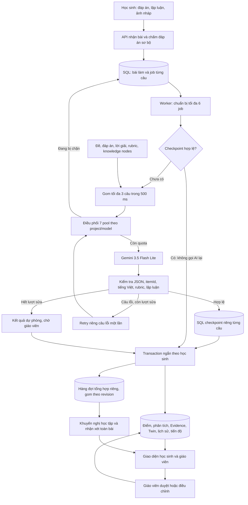

# Rà soát trước push: kiến trúc chấm AI hàng loạt — 07/10/2026

> Cập nhật sau lượt rà soát: ba lỗi bên dưới đã được sửa và có regression test.
> Xem [bản sửa và giải thích kiến trúc](AI-GRADING-THREE-FIXES-2026-10-07.md).
> Nội dung dưới đây giữ nguyên bằng chứng tại thời điểm phát hiện lỗi.

## Kết luận

Chưa nên push như một bản đã hoàn tất. Có ba vấn đề được xác định bên dưới;
hai vấn đề đã tái hiện bằng test trong bộ nhớ. Lượt rà soát không sửa code xử lý,
không gọi Gemini thật, không sửa dữ liệu ứng dụng và không push.

## Các lỗi cần sửa

### 1. P1 — Fallback có thể cập nhật Twin sai thứ tự nộp bài

`src/EduTwin.BLL/AssessmentAndReasoning/Processing/AIAnalysisJobProcessor.cs:597`

Nhánh thành công kiểm tra `HasEarlierUnfinishedAnalysisAsync` trước khi cập nhật
Twin. Nhánh `PersistAnalysisFailureAsync` sau khi hết lượt retry lại gọi trực tiếp
`_twinCompletionOrchestrator.CompleteAsync` mà không có kiểm tra tương tự.
Khóa theo học sinh chống ghi đồng thời nhưng không đảm bảo thứ tự thời gian.
Vì mastery được tính dựa trên trạng thái trước đó, các bằng chứng đúng/sai xử lý
khác thứ tự có thể làm khác hồ sơ năng lực và khuyến nghị học tập.

Test `Audit_LaterFallbackMustWaitForEarlierEvidence` dựng hai lượt nộp cùng học sinh,
câu trước vẫn Processing, câu sau đã dùng một lượt retry và AI giả lập lỗi tiếp.
Test xác nhận câu sau đã ghi một lịch sử Twin khi câu trước vẫn Processing;
kỳ vọng RetryScheduled nhưng thực tế FallbackCompleted.

Hướng sửa: áp dụng cùng hàng rào thứ tự cho nhánh fallback. Lưu được trạng thái
dự phòng chờ commit để không gọi AI thêm chỉ vì đang chờ câu trước. Không làm
tăng số retry và không biến chờ thứ tự thành lỗi AI mới. Kiểm tra riêng fallback
đầu/cuối bài, fallback sau lỗi ảnh, và phục hồi thủ công của fallback.

### 2. P2 — Không thực thi giới hạn Gemini đồng thời chung khi đã chia nhiều pool

`src/EduTwin.API/AssessmentAndReasoning/AI/GoogleGenAIGenerateContentClient.cs:77`

`GeminiOptions.MaxConcurrentRequests=2` chỉ được sử dụng khi sinh pool mặc định
nếu `QuotaPools` rỗng. Khi cấu hình bảy pool riêng, client chỉ giữ lease từng pool.
Không có gate chung sử dụng trường cấu hình này.

Runtime hiện tại: bảy pool, mỗi pool có concurrency 1; worker chuẩn bị 6 job.
Hai batch đủ ba câu thường tạo ra hai lời gọi, nhưng đây là hệ quả của hình dạng
batch, không phải giới hạn cứng. Semantic repair chạy singleton và các lời gọi
Gemini khác có thể khiến tổng số lời gọi đồng thời vượt 2.

Hướng sửa: bổ sung gate/lease chung cho mọi lời gọi Gemini, bao gồm singleton,
batch, retry và enrichment. Nếu muốn nhiều API/worker instance, gate chung phải
được phối hợp ở SQL, không chỉ semaphore trong một process. Giữ gate theo pool
và RPM/TPM/RPD; không thay nó bằng gate chung. Không giữ transaction trong lúc
gọi dịch vụ và không chiếm slot chung để chờ một pool hết quota.

Giải thích trước đó "max 2 chung cho cả bảy key" chưa phản ánh đầy đủ code
hiện tại. Số đo 81,97 giây vẫn là số đo thật của runtime này, nhưng không chứng
minh tất cả lời gọi đã nằm dưới một gate chung 2. Cần đo lại sau khi sửa nếu
muốn so sánh độ trễ dưới giới hạn đó.

### 3. P2 — Hẹn chạy lại theo pool cuối, thay vì pool khả dụng sớm nhất

`src/EduTwin.API/AssessmentAndReasoning/AI/GoogleGenAIGenerateContentClient.cs:99`

Biến `retryAfter` bị gán lại theo từng pool. Nếu tất cả pool đang bị chặn, thời gian
hẹn chạy lại là của pool kiểm tra cuối. Có pool sẵn sàng sớm hơn nhưng bài vẫn
có thể bị trì hoãn lâu không cần thiết. `Defer` hiện chặn thời gian tối đa mỗi lượt
là 3.600 giây; chặn này vẫn có thể làm người học chờ một giờ thay vì vài giây.

Test `Audit_QuotaWaitMustChooseEarliestAvailablePool` cấu hình hai key giả, hai pool
đều bị chặn trước SDK: pool nhanh hồi sau 10 giây, pool chậm hồi sau 5 giờ.
Kết quả: kỳ vọng RetryAfter 00:00:10; thực tế 05:00:00. Không tạo SDK client,
không có request mạng và không sử dụng quota thật.

Hướng sửa: giữ thời điểm khả dụng sớm nhất trong số pool/credential hợp lệ,
tính cả cooldown/Retry-After đã lưu. Không chọn key bị 401/403/404 tạm loại khỏi
model. Mã UI cần thể hiện đúng nhóm nguyên nhân chờ, không suy ra mọi pool hết
quota ngày chỉ vì một pool bị daily quota.

## Bằng chứng test

- Backend hiện có: **3.891 passed, 70 skipped, 0 failed**. Test MySQL/Gemini opt-in
  không được bật trong lượt này.
- Frontend: **562 passed, 0 failed**.
- Frontend production build: **thành công**, Vite 6.4.3, 21,13 giây. Có cảnh báo
  chunk MathLive lớn hơn 600 kB; đây không phải lỗi pipeline chấm AI.
- Hai test chẩn đoán mới thất bại đúng tại điều kiện cần kiểm tra ở mục 1 và 3.
  Không để hai test này nằm trong cây test đang build khi chưa triển khai sửa.
- Mã tái hiện được lưu tại `docs/verification/evidence/ai-prepush-audit/AIPrePushAuditProbe.cs`.
  Nó là partial class dùng các helper hiện có; để chạy lại, đưa file vào thư mục
  test Processing và lọc hai tên test `Audit_LaterFallbackMustWaitForEarlierEvidence`
  và `Audit_QuotaWaitMustChooseEarliestAvailablePool`.
- `git diff --check` không có lỗi khoảng trắng; thông báo LF/CRLF là cảnh báo Git.

Các test hiện có xanh không phủ định hai tình huống lỗi mới. Lượt UI mới có
50/50 thành công nên không kiểm tra được nhánh fallback terminal; cũng không
đụng tình huống mọi pool bị chặn nhưng hồi quota ở thời điểm khác nhau.

## Kiến trúc đang được triển khai

Sơ đồ dưới đây mô tả code hiện tại, không giả định ba lỗi đã sửa.

Chú ý: nhánh chờ quota đang có lỗi chọn thời gian ở mục 3; gate chung 2 còn thiếu
ở mục 2; hàng rào thứ tự hiện bảo vệ nhánh thành công nhưng chưa bảo vệ fallback
ở mục 1. Không diễn giải sơ đồ là đã khắc phục những điểm này.

## Thông số hiện tại và ý nghĩa

| Thành phần | Cấu hình / hành vi hiện tại |
|---|---|
| Worker chuẩn bị job | 6 job đồng thời; không đồng nghĩa 6 request trong một key |
| Discovery | 24 job/trung tâm mỗi đợt; batch discovery tổng mặc định 50 |
| Microbatch | Tối đa 3 câu; cửa sổ 500 ms; không phải chia 50 câu thành hai nửa |
| Partition | Cùng trung tâm, học sinh, bài tập, ngôn ngữ và schema |
| Giới hạn input một batch | 24.000 ký tự request đã serialize và tối đa 3 ảnh |
| Model đang chạy | gemini-3.5-flash-lite |
| Timeout gọi provider | 30 giây, tính cho invocation/batch; SDK automatic attempts=1 |
| Pool | Bảy pool, mỗi pool concurrency 1, quota RPM/TPM/RPD theo cấu hình |
| Trường global max=2 | Có cấu hình nhưng chưa thành gate chung khi có nhiều pool |
| Phản hồi lỗi nội dung | Kiểm tra từng item; giữ các câu thành công; một semantic repair riêng |
| Chờ quota/capacity | Hẹn lại trong SQL; không tiêu hao lượt retry nội dung |
| Checkpoint | Theo bài làm, ảnh, lời giải, version câu hỏi và profile AI |
| Cập nhật Twin | Inference song song; commit theo học sinh và thứ tự bằng chứng ở nhánh thành công |
| Tổng hợp | Hàng đợi riêng, gom revision, đợi các câu kết thúc; không bắt pipeline câu chờ tạo lộ trình |
| UI cập nhật nền | Một detail request khoảng 5 giây; không polling 50 câu riêng; ngừng khi xong hoặc sau lỗi mạng liên tiếp |

Mọi câu đã trả lời, kể cả trắc nghiệm, vẫn được AI phân tích lập luận. Bộ chấm
quy tắc tạo điểm đáp án sơ bộ không thay thế bước AI này. Câu tự luận/Manual vẫn
được AI đề xuất điểm, rubric và nhận xét; giáo viên duyệt điểm chính thức.
Lời giải giáo viên là tham khảo, không phải cách giải duy nhất. Bằng chứng sai
được gắn với kiến thức/lỗi lập luận để phục vụ Twin và lộ trình, không chỉ chấm điểm.

Adapter Groq có trong code nhưng runtime hiện dùng Gemini; chưa chạy local AI.
Không tự chuyển model/provider chưa được nghiệm thu chỉ để tăng tốc.

## Chỗ tối ưu thực sự

1. API lưu bài và trả kết quả nhận bài, không giữ request người học đến lúc AI xong.
2. Gom nhiều câu trong một request nhưng có kết quả độc lập theo itemId.
3. Xử lý chuẩn bị, đọc ảnh, gọi inference song song có giới hạn.
4. Phản hồi hợp lệ được giữ checkpoint; lỗi DB hoặc chờ thứ tự không làm gọi lại AI.
5. Chỉ xử lý lại câu lỗi, không chấm lại toàn bộ 50 câu.
6. Quota/cooldown theo project/model được lưu SQL và phối hợp giữa worker.
7. Transaction cập nhật Twin không giữ khóa trong lúc gọi Gemini.
8. Tổng hợp nhận xét/lộ trình chạy riêng và gom yêu cầu, giảm tác vụ lặp từng câu.
9. UI không tạo 50 vòng polling và không coi chờ giáo viên là AI còn xử lý.

50 câu, nếu luôn đủ batch 3 và không lỗi, cần tối thiểu ceil(50/3)=17 request;
100 câu cần tối thiểu 34. Partition, phần dư, ảnh, kích thước input và retry có
thể tăng số request. Lượt thật học sinh 3: **81,97 giây, 22 request, 0 fallback**,
so với lượt trước 190,12 giây, 32 request. Không dùng một lần đo làm cam kết thời
gian cho mọi học sinh hoặc suy ra đã kiểm thử tải hàng nghìn người đồng thời.

Trước push cần sửa ba lỗi, thêm regression test cho nhiều pool/singleton retry,
fallback sai thứ tự và earliest availability. Sau đó đo thêm bằng test giả lập
tải nhiều học sinh; chỉ chạy thêm Gemini thật khi cần nghiệm thu quota/thời gian.
