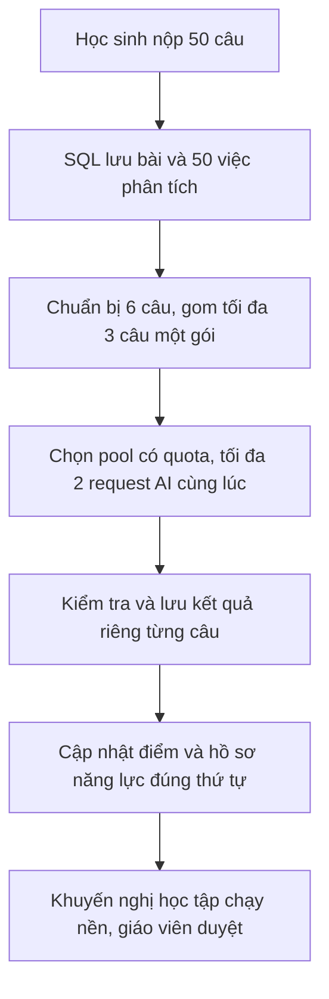

# Chấm AI hàng loạt: sửa ba lỗi và giải thích kiến trúc

## Thay đổi đã triển khai

1. Nhánh fallback có cùng hàng rào thứ tự bằng chứng như nhánh AI thành công.
   Khi phải chờ câu trước, job lưu quyết định đã hết lượt retry trong SQL; lần
   sau tiếp tục hoàn tất fallback, không đọc ảnh hoặc gọi AI lại chỉ vì chờ thứ tự.
   Discovery cũng bỏ qua quyết định đang chờ để không claim/requeue liên tục.
2. `Gemini.MaxConcurrentRequests=2` nay được áp dụng chung bằng một ledger SQL
   riêng cho mọi lời gọi qua Gemini client, kể cả batch, singleton retry và
   enrichment. Đồng thời vẫn kiểm tra giới hạn từng project/model. Hai reservation
   được lưu cùng transaction: pool bị chặn không chiếm slot hoặc mất quota oan.
   Release dùng cùng thứ tự khóa; lease hết hạn giúp hồi slot khi worker bị dừng.
   Client áp dụng một deadline cho toàn invocation, kể cả enrichment, để lời gọi
   không tiếp tục chạy quá thời hạn lease; phân biệt timeout và hủy từ phía caller.
   Các API instance phải dùng chung database và cùng cấu hình giới hạn.
3. Khi các pool bị chặn, chọn thời gian chờ ngắn nhất, không chọn pool cuối.
   Dùng cooldown thực tế đã lưu, kể cả Retry-After của provider. Chỉ gọi nguyên
   nhân là quota ngày khi tất cả pool đang chờ đều là quota ngày.

Không cần migration mới: dùng bảng quota và các trường diagnostic job đã có.
Không sửa đáp án, bài làm, điểm hay Twin hiện có của người dùng.

## Hiểu đơn giản bằng bài tập 50 câu

- **Job**: một việc phân tích một câu. 50 câu đã trả lời tạo 50 job.
- **Worker**: bộ phận lấy job từ hàng đợi, chuẩn bị đề, đáp án, lập luận và ảnh.
  Hiện chuẩn bị tối đa 6 job song song; không có nghĩa được gọi 6 request Gemini.
- **Batch**: một gói gom tối đa 3 câu của cùng học sinh/bài tập, trong 500 ms.
- **Request**: một lần gửi gói đó đến Gemini. Một request có thể phân tích 3 câu.
- **Pool**: nhóm key được quản lý quota theo project/model, không phải một học sinh.
- **Checkpoint**: bản kết quả hợp lệ được giữ tạm trong SQL. Nếu chỉ lỗi lưu dữ
  liệu hoặc chờ câu trước, dùng lại bản này, không bắt AI phân tích lần nữa.
- **Fallback**: kết quả dự phòng khi phân tích không thành công sau lượt sửa cho
  phép; không phải kết quả được AI công nhận. Giáo viên cần xem xét.

Ví dụ lý tưởng, không lỗi và gói luôn đủ:

1. Học sinh nộp, hệ thống lưu toàn bộ bài trước.
2. Chuẩn bị câu 1–6, gom thành hai gói: 1–3 và 4–6.
3. Gọi Gemini cho hai gói song song. Nếu một gói xong trước thì slot chung có thể
   được tái sử dụng khi worker có việc tiếp theo; không chờ toàn bộ bài rồi mới lưu.
4. Đối chiếu kết quả từng câu theo itemId, lưu checkpoint, rồi cập nhật dữ liệu
   chính thức theo thứ tự bằng chứng của học sinh.
5. Tiếp tục các gói sau. Nếu câu 5 trả JSON/lập luận không hợp lệ, chỉ sửa câu 5;
   không gọi lại cả 50 câu. Nếu đang chờ quota thì hẹn lại, không tính là lỗi chấm.
6. Từ điểm/lỗi sai/kiến thức liên quan, cập nhật Twin. Hàng đợi tổng hợp riêng
   tạo khuyến nghị và nhận xét toàn bài; giáo viên duyệt điểm theo chính sách.

50 câu cần tối thiểu `ceil(50/3)=17` request; 100 câu tối thiểu 34. Phần dư,
ảnh, kích thước input, nhiều partition và sửa phản hồi lỗi có thể làm tăng số này.
Giới hạn 2 là **hai request tại một thời điểm trên cả nhóm**, không phải hai
request cho cả bài và cũng không phải 2 request/key nhân 7 thành 14 request.

Trắc nghiệm vẫn được AI phân tích lập luận. AI được cung cấp đáp án/lập luận/ảnh
nháp của học sinh và tài liệu tham khảo/rubric của giáo viên. Chấp nhận cách giải
khác có logic hợp lệ, không bỏ kiểm tra ngụy biện để đổi lấy tốc độ. Nhận xét AI
bằng tiếng Việt, còn đáp án môn Tiếng Anh vẫn có thể là tiếng Anh.

## Xác minh

- Test tập trung ban đầu: 28 passed.
- Toàn bộ backend lượt cuối: **3.904 passed, 72 skipped, 0 failed** (46 giây).
  Các test MySQL opt-in được chạy riêng như bên dưới, không phải được bật trong
  lượt chạy toàn bộ; các test Gemini thật không bật.
- MySQL: 3 test concurrency và pipeline 50/100 câu đạt; test fallback có thứ tự
  trên SQL riêng cũng đạt. Database test tự dọn sau mỗi lượt; không sử dụng Gemini thật.
- Một lần chạy toàn bộ trong lúc build Docker bị flaky ở test batch dùng 20 ms
  của đồng hồ thật (21 request thay vì kỳ vọng 20). Đã thêm TimeProvider mặc định
  System và đồng hồ giả cho test để giữ kiểm tra chính xác số batch; thêm test
  partial batch chỉ flush đúng cửa sổ đã cấu hình. Không đổi cửa sổ production 500 ms.
- Lượt 81,97 giây trước đây là benchmark trước khi bổ sung gate SQL chung, không
  dùng làm cam kết tốc độ cho bản mới. Chưa chạy thêm bài 50 câu trên tài khoản học sinh.
- Chưa push.
- Docker API đã build Release thành công (0 warning, 0 error) và recreate riêng
  service API. Giữ nguyên web, MySQL và tất cả volume; không cần migration mới.
  Container khớp image mới; `/api/v1/health/ready` trả API/MySQL Healthy.
