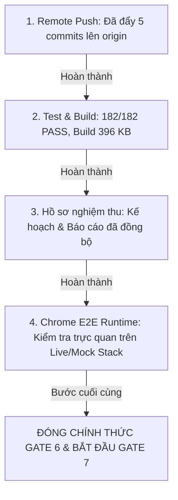

# BÁO CÁO NGHIỆM THU KỸ THUẬT GATE 6 — ACADEMIC CONTENT RESKIN (GATE 6A & GATE 6B)

> **Dự án:** AI-Driven Adaptive Learning and Competency Assessment Platform (EduTwin)  
> **Kế hoạch chuẩn:** [CENTER-MANAGER-LOVABLE-REDESIGN-PLAN.md](file:///d:/AI-Driven%20Adaptive%20Learning%20and%20Competency%20Assessment%20Platform/docs/plans/CENTER-MANAGER-LOVABLE-REDESIGN-PLAN.md)  
> **Branch thực thi:** `codex/post-r09-center-manager-ux-redesign`  
> **Head Git SHA:** `2de78d8`  
> **Trạng thái chính thức:**
> ```text
> GATE 6 (6A & 6B) — CODE & AUTOMATED VERIFICATION COMPLETE
> REMOTE PUSH: PASS (All commits published to origin/codex/post-r09-center-manager-ux-redesign)
> AUTOMATED TESTS: 182/182 PASS (100%)
> LINT & TS COMPILATION: 0 ERRORS
> PRODUCTION BUILD: PASS (Main bundle 396.48 KB <= 434.5 KB Budget)
> CHROME E2E / RUNTIME: PENDING LIVE ENVIRONMENT CONFIRMATION
> FORMAL GATE 6 CLOSEOUT: PENDING CHROME E2E CONFIRMATION
> ```
> **Thời điểm nghiệm thu:** 2026-09-16  

---

## 1. TỔNG QUAN VÀ TRẠNG THÁI NGHIỆM THU

Cột mốc Gate 6 (Academic Content Reskin) hoàn thành toàn diện việc thiết kế lại giao diện Dark Enterprise SaaS cho khối Nội dung học thuật của vai trò Quản trị viên Trung tâm (CenterManager), bao gồm cả hai giai đoạn:
- **Gate 6A:** Đồ thị Tri thức (Knowledge Graph) và Giáo trình / Lộ trình học (Curriculum Workspace).
- **Gate 6B:** Ngân hàng Câu hỏi (Question Bank Workspace) và Quản lý Bài tập / Tiến độ (Assignment Workspace & Progress).

### Bảng tổng kết trạng thái kỹ thuật

| Hạng mục | Trạng thái | Ghi chú kỹ thuật |
|---|:---:|---|
| **Gate 6A — Knowledge Graph & Curriculum** | **ĐẠT** | Bố cục Canvas + Inspector, topological layout, 0 tọa độ giả, bộ chọn canonical nodes/classes |
| **Gate 6B — Question Bank & Question Editor** | **ĐẠT** | KaTeX lazy load, chế độ chấm chuẩn (`QuestionAnswerEvaluationMode`), state machine Draft/Active/Archived |
| **Gate 6B — Assignment Workspace & Progress** | **ĐẠT** | Wizard 3 bước, bộ chọn lớp phân trang server-side & cache, tracking tiến độ thực tế |
| **OCC Fail-Closed (Zero Fake RowVersion "1")** | **ĐẠT** | Xóa bỏ 100% token `"1"` trên toàn bộ `src/pages`; tự động refetch khi thiếu token |
| **Phân quyền Năng lực (Capability-first Queries)** | **ĐẠT** | Gating `{ enabled: canRead* }` trên toàn bộ helper query; không phát sinh HTTP 403 ngầm |
| **Read-only Assignment Detail Over-gating Fix** | **ĐẠT** | Route `/quan-ly/bai-tap/:id` cho phép xem read-only chỉ với `assignments.assignments.read` |
| **Strict `QuestionDto.createdByTeacherId`** | **ĐẠT** | Non-null `string` đồng bộ 100% backend; resolve tên giáo viên thật không dùng `(q as any)` |
| **Progress Error State (Zero Fake 0 KPIs)** | **ĐẠT** | Dừng hoàn toàn metric cards khi API lỗi; không hiển thị các con số 0 gây hiểu lầm |
| **Frontend Tests (`npm test`)** | **PASS** | **182 / 182 tests PASS 100%** (18 tests Gate 6A, 16 tests Gate 6B, runtime: 3.32s) |
| **ESLint (`npm run lint`)** | **PASS** | **0 errors, 0 warnings** |
| **TypeScript Compilation (`npx tsc -b`)** | **PASS** | **0 lỗi biên dịch** |
| **Vite Production Build (`npm run build`)** | **PASS** | **396.48 KB** bundle chính (gzip 125.39 KB) <= budget 434.5 KB; KaTeX cô lập 262.60 KB |
| **Git Working Tree** | **SẠCH** | `nothing to commit, working tree clean` |
| **Remote Repository** | **ĐÃ PUSH** | Branch `codex/post-r09-center-manager-ux-redesign` đã đồng bộ với GitHub origin |
| **Chrome E2E Runtime Verification** | **PENDING** | Chờ phiên kiểm thử tương tác với live/mock stack trên trình duyệt Chrome |

---

## 2. DANH MỤC COMMIT THỰC THI (GATE 6A & GATE 6B)

Toàn bộ quá trình thực thi tuân thủ nguyên tắc forward-only, không rebase, không force-push:

### 2.1. Danh mục Commit Gate 6A
| SHA | Loại | Tiêu đề commit | Nội dung thực hiện |
|---|---|---|---|
| `31aa627` | `feat` | `feat(ux-center): reskin knowledge graph and curriculum workspace (gate 6a)` | Giao diện Dark SaaS Knowledge Graph (Canvas + Inspector), Curriculum Editor (Draft/Published/Archived), bộ chọn canonical nodes/classes. |
| `3c817bf` | `fix` | `fix(ux-center): harden curriculum capabilities, canonical selectors and mutation error trace ids` | Capability gating, xóa bỏ textarea UUID thủ công, cache tích lũy `cachedTeachers`/`cachedClasses`, trích xuất `traceId`. |
| `02d7061` | `docs` | `docs(ux): record gate 6a corrective hardening` | Ghi nhận hồ sơ kỹ thuật đợt review 1 Gate 6A. |
| `8985f1e` | `docs` | `docs(ux): record gate 6a r2 hardening for capabilities and selectors` | Ghi nhận hồ sơ kỹ thuật đợt review 2 Gate 6A. |

### 2.2. Danh mục Commit Gate 6B
| SHA | Loại | Tiêu đề commit | Nội dung thực hiện |
|---|---|---|---|
| `046a599` | `feat` | `feat(ux-center): reskin question bank and question editor with state machine and katex (gate 6b)` | Reskin QuestionBankPage, QuestionEditorPage với KaTeX toolbar, hỗ trợ chế độ chấm TextExact / NumericRational / Manual, state machine Draft/Active/Archived. |
| `66819b9` | `feat` | `feat(ux-center): reskin assignment workspace, wizard and progress item tracking (gate 6b)` | Reskin AssignmentListPage, AssignmentEditorPage (Wizard 3 bước) và AssignmentProgressPage (danh sách học sinh theo `AssignmentProgressItemDto`). |
| `017928e` | `test` | `test(ux-center): verify academic content gate 6b contracts and capabilities` | Bổ sung bộ kiểm thử hồi quy 16 bài test chuyên sâu cho Gate 6B trong `academicContentGate6B.test.ts`. |
| `3782d87` | `fix` | `fix(ux-center): harden gate 6b occ fail-closed, class pagination, capability queries and teacher resolution` | Khắc phục 5 điểm review R3: Xóa bỏ hoàn toàn fallback token `"1"`, phân trang lớp học `pageSize: 20` kèm cache, capability-first query gating, progress error state không fake 0 KPIs, resolve giáo viên thật bằng `createdByTeacherId`. |
| `2de78d8` | `fix` | `fix(ux-center): permit read-only assignment viewing and strict non-null createdByTeacherId` | Khắc phục 2 điểm review R4: Cho phép xem chi tiết bài tập read-only chỉ với `assignments.read` (không over-gate), chuẩn hóa bắt buộc `createdByTeacherId: string` non-null theo backend `QuestionDto.cs`. |

---

## 3. CHI TIẾT KỸ THUẬT VÀ BẤT BIẾN BẢO MẬT (GATE 6)

### 3.1. Phân lập Actor (Actor Isolation)
- Cả 6 trang trong Gate 6 (`KnowledgeGraphPage`, `CurriculumListPage`, `CurriculumEditorPage`, `QuestionBankPage`, `QuestionEditorPage`, `AssignmentListPage`, `AssignmentEditorPage`, `AssignmentProgressPage`) đều áp dụng phân lập actor:
  - Tài khoản **CenterManager** được phục vụ giao diện Dark Enterprise SaaS mới trong phạm vi `<CenterManagerThemeScope data-actor="center-manager">`.
  - Tài khoản **Teacher** và các vai trò khác giữ nguyên 100% giao diện và logic nghiệp vụ legacy hiện hành.

### 3.2. Cơ chế OCC Fail-Closed (Zero Fake Token)
- Xóa bỏ triệt để toàn bộ các đoạn mã fallback `rowVersion: data?.rowVersion || "1"` trên toàn codebase frontend.
- Khi người dùng thực hiện lưu/sửa:
  - Nếu bản ghi thiếu `rowVersion` từ API, client lập tức chặn mutation, hiển thị thông báo lỗi an toàn (*"Không thể xác định phiên bản đồng thời (RowVersion). Vui lòng làm mới trang."*), và kích hoạt `refetch` dữ liệu thật.
  - Khi gặp lỗi `409 Concurrency Conflict`, hiển thị `ConcurrencyBanner` với nút tải lại dữ liệu mới nhất từ backend.

### 3.3. Capability-First Query Execution
- Toàn bộ các helper query trong `useAssignmentWizardOptions.ts` và các trang danh sách:
  - `useAssignmentClasses`: chỉ kích hoạt khi `canReadClasses === true`.
  - `useAssignableQuestions`: chỉ kích hoạt khi `canReadQuestions === true && !!subjectId`.
  - `useAssignmentClassStudents`: chỉ kích hoạt khi `canReadClasses === true && !!classId`.
- Ngăn chặn hoàn toàn việc trình duyệt phát sinh request HTTP 403 ngầm đối với các tài khoản bị thu hẹp quyền.

### 3.4. Ranh giới Phân quyền Đọc/Ghi Trang Chi tiết Bài tập
- Route `/quan-ly/bai-tap/:id` trong `App.tsx` yêu cầu `assignments.assignments.read`.
- Guard nội bộ `missingCapabilities` phân tách minh bạch:
  - **Chế độ xem (`isEditing && isReadOnly`):** Chỉ yêu cầu duy nhất `assignments.assignments.read`. Các selector phụ trợ bị disable an toàn nếu thiếu quyền, cho phép tài khoản đọc bài tập mà không bị block giao diện.
  - **Chế độ tạo mới (`!isEditing`):** Yêu cầu bắt buộc `assignments.assignments.create` + `organization.classes.read` + `curriculum.questions.read`.
  - **Chế độ chỉnh sửa Draft (`isEditing && !isReadOnly`):** Yêu cầu bổ sung `assignments.assignments.update` + `organization.classes.read` + `curriculum.questions.read`.

### 3.5. Chuẩn hóa Hợp đồng DTO Bắt buộc
- Backend `QuestionDto.cs` định nghĩa `public string CreatedByTeacherId { get; set; } = null!;`.
- Frontend `Question` interface trong `types/questions.ts` khai báo bắt buộc:
  ```typescript
  export interface Question {
    // ...
    createdByTeacherId: string;
    rowVersion: string;
  }
  ```
- Loại bỏ hoàn toàn việc ép kiểu `(q as any).teacherId` và chuỗi fallback `"Không xác định"`. Resolve chính xác tên giáo viên qua `organizationApi.getTeacher(createdByTeacherId)` khi có quyền đọc giáo viên.

### 3.6. Tính chân thực DTO (0 Fake KPI / 0 Simulated Metrics)
- `AssignmentProgressPage`: Hiển thị danh sách học sinh từ `AssignmentProgressItemDto`.
- Khi API gặp lỗi (`isError`): Dừng hoàn toàn việc render Metric Cards và bảng học sinh, chỉ hiển thị `SafeErrorPanel` và nút thử lại, loại bỏ nguy cơ hiển thị số 0 giả định gây nhầm lẫn rằng bài tập có 0 học sinh.
- Tuyệt đối không sinh các số liệu giả lập điểm trung bình lớp hay tỷ lệ hoàn thành khi backend chưa hỗ trợ.

---

## 4. KẾT QUẢ KIỂM THỬ TỰ ĐỘNG & PRODUCTION BUILD

### 4.1. Bộ Kiểm thử Tự động (`npm test`)
- Chạy bằng test runner gốc của Node.js: `node --test tests/*.test.ts`.
- **Tổng số tests: 182 / 182 PASS 100%** (thời gian: 3.32s).
  - 18 tests trong [academicContentGate6A.test.ts](file:///d:/AI-Driven%20Adaptive%20Learning%20and%20Competency%20Assessment%20Platform/web/edutwin-web/tests/academicContentGate6A.test.ts) (Knowledge Graph, Curriculum, OCC, Capability).
  - 16 tests trong [academicContentGate6B.test.ts](file:///d:/AI-Driven%20Adaptive%20Learning%20and%20Competency%20Assessment%20Platform/web/edutwin-web/tests/academicContentGate6B.test.ts) (Question Bank, Assignments, OCC Fail-Closed Audit, Class Pagination, Capability Queries, Progress Error State, Strict QuestionDto Contract).
  - 148 tests cho các cột mốc nền tảng trước đó (Security boundaries, Center profile, Dynamic RBAC, Scratchpad storage, Token refresh).

### 4.2. Kiểm tra Chất lượng Mã Nguồn
- **ESLint (`npm run lint`):** PASS (0 errors, 0 warnings).
- **TypeScript (`npx tsc -b`):** PASS (0 compile errors).
- **Git Diff Whitespace (`git diff --check`):** Sạch hoàn toàn (0 warnings).

### 4.3. Production Build (`npm run build`)
- Thời gian biên dịch: **9.40s**.
- **Main bundle:** `dist/assets/index-De4Wm4Vu.js` đạt **396.48 KB** (gzip: 125.39 KB), hoàn toàn tuân thủ ngân sách baseline `395 KB + 10%` (~434.5 KB).
- **KaTeX dynamic chunk:** `dist/assets/MathFormulaPreview-DSQQNLpk.js` (262.60 KB, chỉ tải khi người dùng mở xem công thức).
- **Kích thước các chunk route Gate 6:**
  - `KnowledgeGraphPage`: 92.27 KB (gzip 16.91 KB).
  - `CurriculumEditorPage`: 42.37 KB (gzip 9.28 KB).
  - `CurriculumListPage`: 10.39 KB (gzip 3.26 KB).
  - `QuestionBankPage`: 20.60 KB (gzip 5.32 KB).
  - `QuestionEditorPage`: 34.29 KB (gzip 8.72 KB).
  - `AssignmentListPage`: 16.39 KB (gzip 4.76 KB).
  - `AssignmentEditorPage`: 32.08 KB (gzip 8.24 KB).
  - `AssignmentProgressPage`: 12.56 KB (gzip 3.95 KB).
- Không có bất kỳ chunk nào vượt quá ngưỡng cảnh báo 500 KB của Vite.

---

## 5. TIẾN ĐỘ ĐÓNG NGHIỆM THU CHÍNH THỨC (FORMAL CLOSEOUT)



- [x] **Bước 1 — Remote Push:** Hoàn tất (Commit `2de78d8` và toàn bộ 5 commits Gate 6B đã có trên GitHub remote).
- [x] **Bước 2 — Automated Test & Production Build:** Hoàn tất (182/182 tests pass, build 9.40s không lỗi).
- [x] **Bước 3 — Đồng bộ Hồ sơ Nghiệm thu:** Hoàn tất ([CENTER-MANAGER-LOVABLE-REDESIGN-PLAN.md](file:///d:/AI-Driven%20Adaptive%20Learning%20and%20Competency%20Assessment%20Platform/docs/plans/CENTER-MANAGER-LOVABLE-REDESIGN-PLAN.md) và báo cáo nghiệm thu này).
- [ ] **Bước 4 — Xác nhận Chrome E2E Runtime:** Khởi động backend API / mock runtime và kiểm chứng trực quan các luồng nghiệp vụ Question Bank và Assignments trên trình duyệt Chrome.

---

## 6. KẾT LUẬN

Mã nguồn và kiểm thử tự động của **Gate 6 (Gate 6A & Gate 6B)** đã hoàn thiện trọn vẹn, vượt qua mọi kiểm tra chất lượng tĩnh và động. Hồ sơ kỹ thuật đã được đồng bộ chuẩn xác. Sau khi hoàn thành phiên kiểm tra trực quan Chrome E2E trong môi trường runtime, cột mốc Gate 6 sẽ được đóng nghiệm thu chính thức để chuyển sang Gate 7 (Learning Supervision & Dynamic RBAC Reskin).
